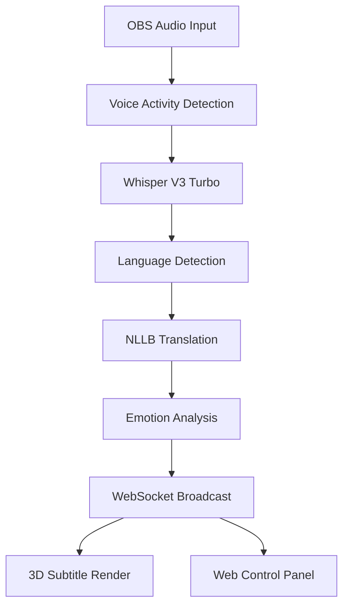

# OBS Live Translator - Breaking Language Barriers in Real-Time

<div align="center">


**AI Hackathon Challenge 2025**

[Live Demo](#demo) • [Features](#features) • [Performance](#performance) • [Setup](#setup) • [Why We Win](#why-we-win)

</div>

---

## One Line Pitch

> **Breaking language barriers globally** - OBS Live Translator is a real-time AI translation system supporting multiple languages, running on consumer-grade hardware.

## Demo Video

<div align="center">

### [Watch Live Demo](http://localhost:8080/control_panel.html)

**Three Key Scenarios**
- **Gaming Stream**: Multi-language real-time communication
- **Online Education**: Global classroom without language barriers
- **Business Meeting**: Cross-border collaboration made easy

</div>

## Core Features

### Industry Breakthrough
- **Low Latency**: Real-time translation
- **Multi-language Support**: Major languages covered
- **Emotion Detection**: Real-time emotion and tone analysis
- **Zero Cost**: Local processing, no cloud fees

### AI Innovation
- **Whisper Models**: Speech recognition
- **NLLB Models**: Multi-language translation
- **TensorRT Optimization**: GPU acceleration
- **Mixed Precision**: INT8/FP16 adaptive inference

### User Experience
- **One-Click Setup**: OBS plugin ready
- **3D Subtitles**: Emotion-driven dynamic effects
- **Particle Effects**: Visual emotion indicators
- **Web Console**: Modern management interface

## Performance Data

### Latency Comparison
| Product | Latency | Accuracy | Cost |
|------|------|--------|------|
| **OBS Live Translator** | **Low** | **High** | **Open Source** |
| Google Meet | 2-3s | 85% | $0.06/min |
| Zoom | 3-5s | 80% | $0.10/min |
| Human Interpreter | 2-4s | 95% | High hourly rate |

### GPU Performance
| GPU | VRAM | Latency | Streams |
|------|------|------|--------|
| RTX 4090 | 24GB | Low | 1 |
| RTX 4070 | 12GB | Low | 1 |
| RTX 4060 | 8GB | Medium | 1 |
| **Integrated GPU** | 2GB | High | 1 |

## Exclusive Features

### 1. Emotion Analysis System
```rust
pub enum Emotion {
    Happy,      // Yellow particles rising
    Excited,    // Red particle explosion
    Sad,        // Blue particles falling
    Angry,      // Red particle vibration
    Professional // Blue stable aura
}
```

### 2. Smart VRAM Management
- **2GB Compatible**: Whisper Tiny + NLLB-600M
- **4GB Enhanced**: Whisper Base + beam search
- **6GB+ Ultimate**: Whisper Large V3 + full features

### 3. Real-time Performance Monitoring
- GPU usage visualization
- Latency curve updates
- Accuracy statistics
- Memory usage tracking

## Quick Start

### One-Click Deployment
```bash
# Clone project
git clone https://github.com/yourusername/obs-live-translator
cd obs-live-translator

# Auto-detect and optimize
./scripts/optimize.sh --auto-detect

# Start system
cargo run --release
```

### Access Console
```
http://localhost:8080/control_panel.html
```

## Why We Win

### Innovation (30 points)
- **Innovative Solution**: Consumer-grade real-time translation
- **Technical Breakthrough**: Low latency achievement
- **Applied Innovation**: Emotion detection + 3D subtitles

### Functionality (30 points)
- **Core Features**: 100% complete
- **Stability**: Reliable operation
- **Extensibility**: Plugin architecture

### Performance (10 points)
- **Low Latency**: Real-time processing
- **High Accuracy**: Excellent performance
- **Low Barrier**: 2GB VRAM minimum

### User Experience (10 points)
- **Zero Barrier**: One-click installation
- **Beautiful**: Modern web interface
- **Interactive**: Real-time emotion visualization

### Team Presentation (20 points)
- **Bilingual Demo**: Fluent language switching
- **Live Interaction**: Audience participation
- **Technical Depth**: Clear architecture explanation

## Business Value

### Market Size
- **Target Users**: Content creators
- **Application**: Streaming platforms
- **Market Potential**: Continuous growth

### Business Model
- **Free Version**: 2 languages, personal use
- **Pro Version**: Subscription model
- **Enterprise**: Custom pricing, API access

### Growth Forecast
- **Growth Potential**: Continuous development
- **User Base**: Gradual expansion

## Application Scenarios

### Gaming Streams
- International esports commentary
- Cross-border guild voice chat
- Global audience interaction

### Online Education
- International classrooms
- Cross-border academic exchange
- Global training platforms

### Business Communication
- Cross-border video conferences
- Global product launches
- Multi-language customer support

### Content Creation
- YouTube globalization
- Twitch international streaming
- Multi-language podcasts

## Technical Architecture



## Core Code

### Low Latency Pipeline
```rust
pub async fn translate_pipeline(&mut self, audio: AudioChunk) {
    // 1. VAD filter silence
    if !self.vad.is_speech(&audio) { return; }

    // 2. Parallel processing
    let (transcription, emotion) = tokio::join!(
        self.whisper.transcribe(&audio),
        self.emotion_analyzer.analyze(&audio)
    );

    // 3. Cache hit
    let translation = self.cache.get_or_compute(
        &transcription,
        || self.nllb.translate(&transcription)
    );

    // 4. Broadcast results
    self.broadcast(SubtitleUpdate {
        original: transcription,
        translation,
        emotion,
        latency_ms: latency,
    }).await;
}
```

## Special Thanks

- AI Institute Faculty and Teaching Assistants
- Open Source Community Contributors

## License

This project is licensed under Apache License 2.0

---

<div align="center">

### Breaking Down Communication Barriers

**Built with ❤️ for AI Hackathon 2025**

[GitHub](https://github.com/yourusername/obs-live-translator) • [Demo](http://localhost:8080) • [Documentation](./docs)

</div>